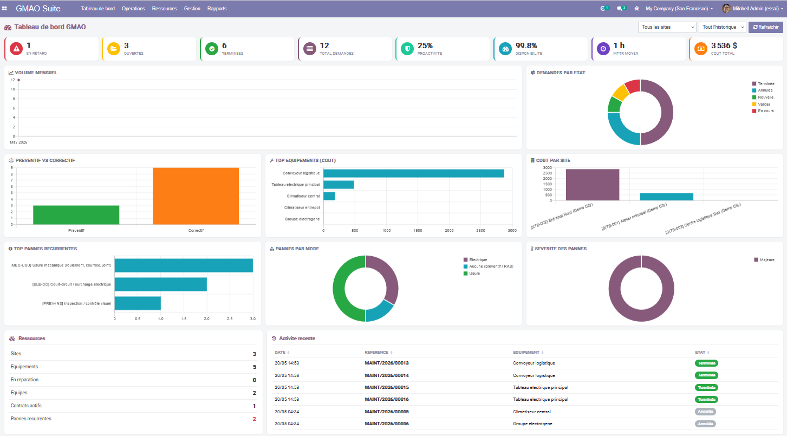
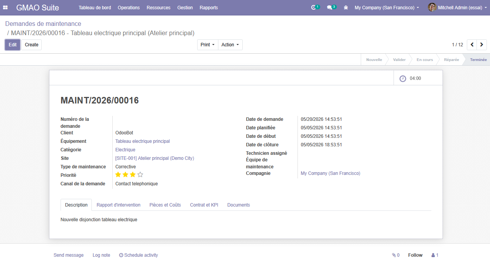
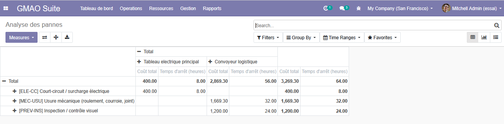
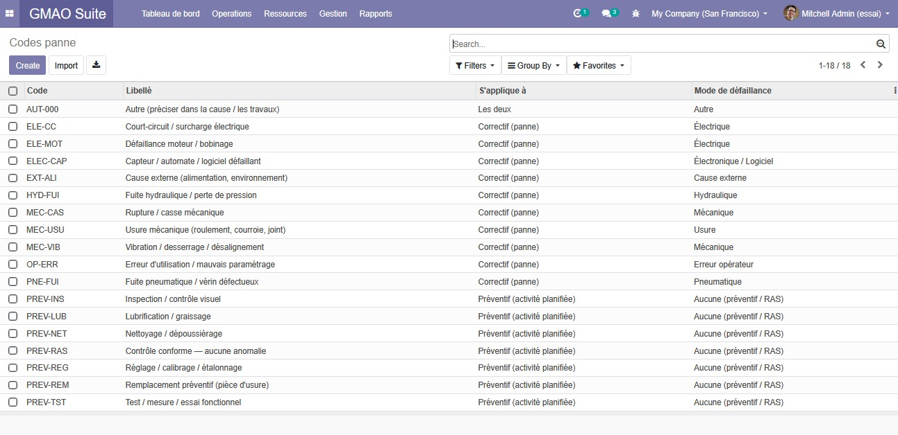
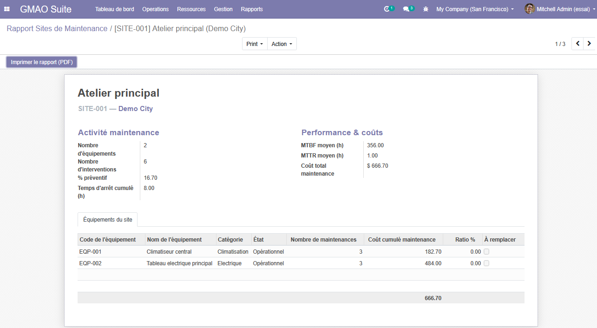
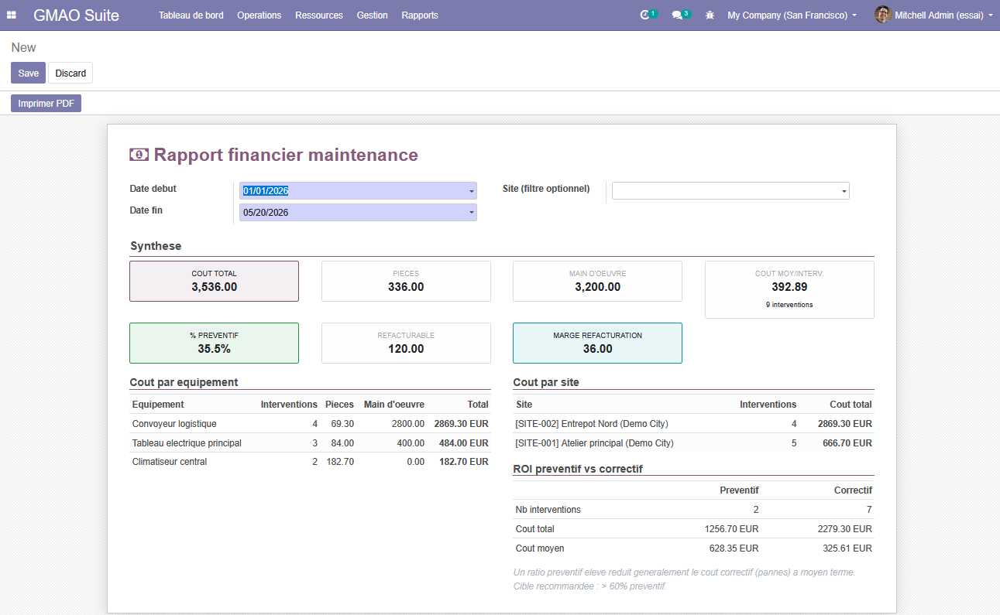
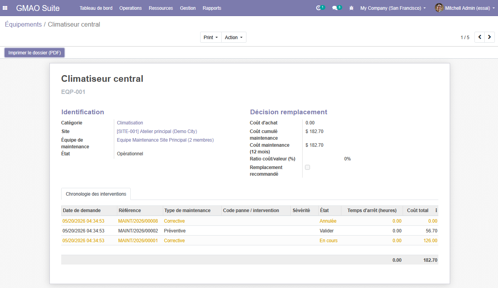
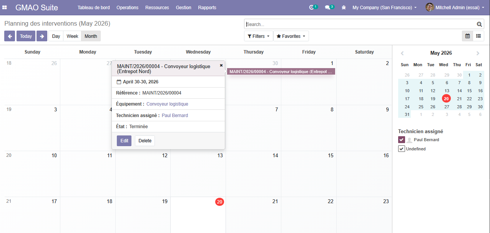

<div align="center">

## **GMAO Suite** 

**Gestion de Maintenance Assistée par Ordinateur**

 Module complet de **GMAO** développé nativement pour **Odoo 13 Community Edition**  
 Auteur : **Emac SAH** — [github.com/kouemousah/GMAO](https://github.com/kouemousah/GMAO)

[](https://www.odoo.com/) [](https://www.python.org/) [](LICENSE) [](https://kouemousah.github.io/GMAO/)

</div>
---

## 🌐 Pages du projet (GitHub Pages)

| Page | URL | Description |
|------|-----|-------------|
| 🏠 **Accueil** | [kouemousah.github.io/GMAO/](https://kouemousah.github.io/GMAO/) | Landing page du projet |
| 💼 **Portfolio** | [Portfolio_Emac_SAH.html](https://kouemousah.github.io/GMAO/Portfolio_Emac_SAH.html) | Portfolio développeur — méthode, projets, stack |
| 🎯 **Solution** | [Presentation_Commerciale_GMAO.html](https://kouemousah.github.io/GMAO/Presentation_Commerciale_GMAO.html) | Présentation commerciale, fonctionnalités, ROI |
| 📐 **Documentation** | [PRD_Technique_GMAO.html](https://kouemousah.github.io/GMAO/PRD_Technique_GMAO.html) | PRD + BPMN + Architecture technique |

---

## 📋 Présentation

**GMAO Suite** digitalise et automatise l'intégralité du cycle de vie de la maintenance industrielle, issu d'une démarche rigoureuse d'analyse des besoins terrain : ateliers métier, cartographie BPMN AS-IS / TO-BE, rédaction de CDC fonctionnel & technique **avant la première ligne de code**.

### État du code (transparence)

| Aspect | Statut |
|---|---|
| Modèles Python | **20** (sites, équipements, équipes, contrats, demandes, pièces, kits, conformité, efficacité + actions, catalogues codes panne & phrases-types, rapports AbstractModel, dashboard) |
| Vues XML | **18** fichiers de vues |
| Rapports QWeb PDF | **10** actions (14 templates) — bon d'intervention, dossier équipement, analyse remplacement, rapport site, conformité, financier, équipe, contrat… |
| Templates email | **13** (`mail.template`) |
| Cycles CRON | **13** (génération préventive, alerte remplacement, contrats expirants, MTBF, rappels J-1…) |
| Wizards | **7** (renouvellement contrat, sélection de kit de pièces, rapports…) |
| Catalogues seedés | **18** codes panne/activité + **15** phrases-types de rapport |
| Sécurité (RBAC) | **8 domaines** × 4 niveaux (reader/creator/user/admin) + multi-société (`ir.rule`) |
| Front | Tableau de bord **Chart.js** plein écran + widgets custom (split-view documents, graphique consommation) |
| Dépendances Python | **PIL** uniquement (bundle Odoo). `matplotlib` lazy-loaded (optionnel). |
| Test d'installation | ✅ Install/upgrade propre Odoo 13 CE (Python 3.7) — `compileall` + parse XML OK |

---

## 📐 Phase 0 — Management & Analyse (avant le code)

1. **Recueil** des besoins utilisateurs (ateliers métier, interviews terrain)
2. **Cartographie BPMN AS-IS** (flux existants, goulots, redondances)
3. **Optimisation TO-BE** (refonte des processus avant digitalisation)
4. **Rédaction CDC** Fonctionnel & Technique (exigences MoSCoW)
5. **Validation & sign-off** parties prenantes
6. **Développement** + tests + déploiement

→ Voir le **[PRD complet](https://kouemousah.github.io/GMAO/PRD_Technique_GMAO.html)** pour le détail.

---

## ✨ Fonctionnalités principales

- 🏭 **Sites & Équipements** — multi-sites, géolocalisation, catégories, coût cumulé, **ratio coût/valeur & recommandation de remplacement**
- 🛠️ **Demandes d'intervention** — corrective & préventive, workflow complet + **génération préventive automatique** (CRON)
- 📝 **Rapport d'intervention structuré** — **codes panne/activité** (catalogue), symptôme, cause racine, travaux, recommandation, sévérité, **phrases-types réutilisables** (sélection + auto-remplissage + création à la volée), **obligatoire avant clôture**
- 🤖 **Aide à la décision** — **analyse de récurrence des pannes** (code × équipement), tableau de bord **Chart.js** temps réel (KPI, MTTR/MTBF, disponibilité, pannes récurrentes), **attribution automatique d'équipe** par scoring multi-critères
- 👷 **Équipes & Techniciens** — charge, taux d'occupation/réussite, MTTR/MTBF, **couverture (sites) & compétences (catégories)**
- 📄 **Contrats de maintenance** — renouvellement (wizard), facturation, **alertes d'expiration**
- 🔩 **Pièces utilisées** — stock natif, allocation, refacturation, **kits de pièces** (sélection au besoin)
- 🛡️ **Conformité & Sécurité** — inspections → **génération de demande corrective** (brouillon)
- ⚡ **Efficacité énergétique** — graphique de consommation + **plan d'actions traçable** (→ demande)
- 📊 **Rapports métier écran + PDF** — dossier équipement, remplacement, site, **analyse des pannes**, bon d'intervention, financier, conformité ; **page détail décisionnelle** au clic + **prévisualisation split-view** des documents
- 📧 **Notifications email** natives (mail.template, 13 templates) — dont alerte remplacement avec PDF joint
- 🔐 **RBAC fin** (8 domaines × 4 niveaux) · 🏢 **Multi-société** (`ir.rule`)

---

## 📸 Aperçu

| | |
|---|---|
|  |  |
|  |  |
|  |  |
|  |  |

---

## ⚙️ Installation

```bash
# 1. Cloner le module dans votre dossier addons Odoo
git clone https://github.com/kouemousah/GMAO.git /path/to/odoo/addons/gmao_suite

# 2. (optionnel) Installer matplotlib pour les graphiques Python
pip install matplotlib

# 3. Update apps list puis installer via UI
./odoo-bin -c odoo.conf -d <db_name> -u gmao_suite --stop-after-init
# OU : Apps → Update Apps List → recherche "GMAO Suite" → Installer
```

### Dépendances Odoo

`base`, `base_address_city`, `mail`, `stock`, `hr`, `web`, `account` (refacturation des pièces)

### Dépendances Python

- **Requises** : `PIL` (bundle Odoo)
- **Optionnelles** : `matplotlib` (uniquement pour les graphiques avancés ; lazy-loaded → l'install marche sans)

### Lancer les tests

```bash
./odoo-bin -c odoo.conf -d <db_name> --test-enable -i gmao_suite --stop-after-init
# Ou sur module deja installe : -u gmao_suite
# Filtrer un tag : --test-tags gmao_install ou gmao_workflow
```

---

## ✅ Déjà livré dans la v13.0.2.x 

Rapport d'intervention structuré (codes panne + phrases-types), **analyse de récurrence des pannes**,
attribution automatique d'équipe par scoring, suivi remplacement (ratio coût/valeur + alerte email PDF),
rapports métier écran+PDF, tableau de bord Chart.js, kits de pièces, conformité→demande, efficacité→plan d'actions,
prévisualisation split-view des documents.

## 🤖 Roadmap (IA & Modernisation)

| Fonctionnalité | Horizon |
|----------------|---------|
| **Maintenance prédictive** — alerte sur récurrence anormale (la base, l'analyse de récurrence, est livrée) | next |
| **OCR** lecture automatique des documents (bons d'intervention, factures pièces) | next |
| Génération automatique des **devis** (pièces + main-d'œuvre) | next |
| Assistant **IA** de rédaction des rapports d'intervention | next |
| Graphiques intégrés dans les **PDF** (rendu image serveur) | next |
| **Application mobile** technicien (saisie terrain, hors-ligne) | next |
| Optimisation planning par apprentissage · Migration **Odoo 17/19** (OWL 2) | 2026 |

---

## 📁 Structure du repository

```
GMAO/
├── index.html                          # Landing page (GitHub Pages)
├── Portfolio_Emac_SAH.html             # Portfolio développeur
├── Presentation_Commerciale_GMAO.html  # Présentation commerciale
├── PRD_Technique_GMAO.html             # PRD + BPMN + architecture
├── 404.html                            # Page d'erreur
├── sitemap.xml / robots.txt            # SEO
├── assets/                             # OG image, favicons
├── images/                             # Screenshots du module
└── gmao_suite/                         # Module Odoo
    ├── __manifest__.py
    ├── __init__.py
    ├── models/                         # 20 modèles Python
    ├── views/                          # 18 vues XML
    ├── wizards/                        # 7 wizards
    ├── reports/                        # 10 rapports QWeb PDF
    ├── security/                       # ir.model.access + groupes (8 domaines)
    ├── data/                           # Séquences + 13 CRON + 13 templates email + catalogues (codes panne, phrases)
    ├── migrations/                     # Scripts de migration (-u)
    ├── controllers/                    # endpoint web
    └── static/                         # JS + CSS + QWeb dashboard + description (icon, fiche Apps)
```

---

## 🧑‍💻 Auteur

**Emac SAH** — Concepteur de solutions sur mesure · Développeur Odoo (CE &amp; Enterprise) & autres ERP · Analyste fonctionnel  
Expérience : Python/ORM, ERP (Odoo & autres) et applications **from scratch**, **tableaux de bord temps réel**, **intégration & automatisation des workflows par l'IA**, refonte de processus métier (BPMN/CDC), architecture multi-société, DevOps

- 📧 [kouemou.sah@gmail.com](mailto:kouemou.sah@gmail.com)
- 🐙 [github.com/kouemousah](https://github.com/kouemousah)
- 🌐 [Portfolio en ligne](https://kouemousah.github.io/GMAO/Portfolio_Emac_SAH.html)

> **Disponible pour missions** : solutions sur mesure (Odoo CE/Enterprise, autres ERP ou *from scratch*), tableaux de bord temps réel, intégration & automatisation des workflows par l'IA, refonte de processus, chefferie de projet technico-fonctionnelle. Réponse sous 24h.

---

## 📄 Licence

**LGPL-3** — voir le fichier [LICENSE](LICENSE).

Compatible publication code source + intégration dans projets commerciaux sous certaines conditions (voir texte de licence).

---

<div align="center">

**GMAO Suite v13.0.2.0.24** · Odoo 13 CE · **Emac SAH**  
[github.com/kouemousah/GMAO](https://github.com/kouemousah/GMAO) · [Pages Live](https://kouemousah.github.io/GMAO/)

</div>
